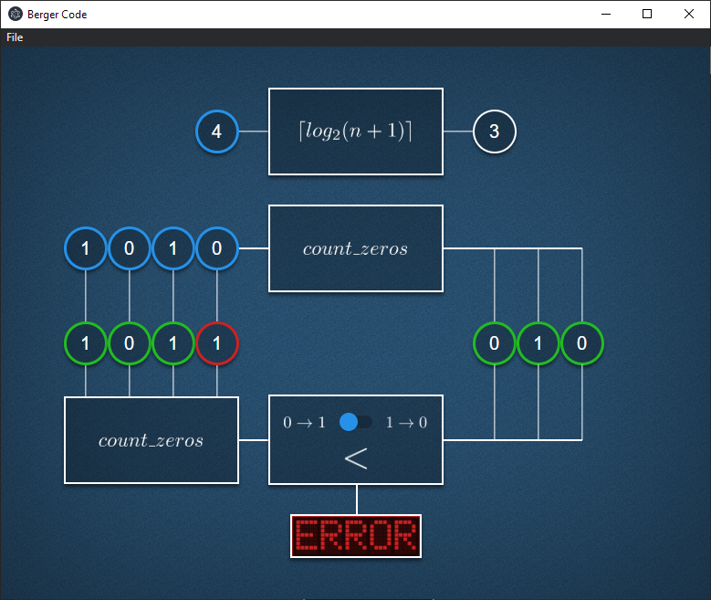

# Visual Representation of Berger Code

Project created for a subject Error Tolerant Systems (or whatever the subject is called) using Angular and Electron.



---

## Prerequisites
- Node.js
- npm

## Usage
```sh
npm i
npm start
```

Starter: https://github.com/maximegris/angular-electron